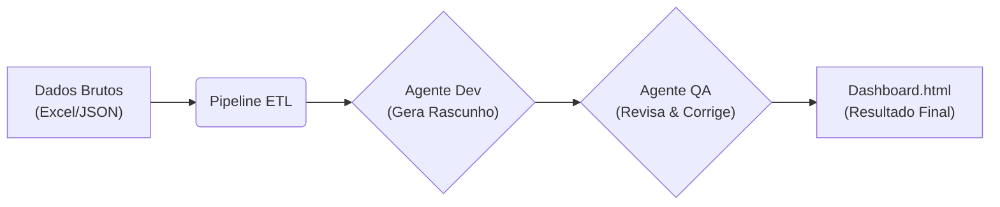

# 📊 AI Insight Pipeline & Dashboard Generator

> **Transforme dados brutos em Dashboards interativos automaticamente usando IA Generativa.**


## 📝 Sobre o Projeto

Este projeto é uma solução de Engenharia de Software que implementa uma **Pipeline de Dados (ETL)** integrada a um fluxo de **Agentes de Inteligência Artificial**.

O sistema é capaz de ler dados de diversas fontes (Excel, JSON, CSV), processá-los e utilizar o modelo **Google Gemini 2.5 Flash** para gerar, codificar e revisar automaticamente um Dashboard HTML interativo com gráficos (via Chart.js).

A principal inovação deste projeto é o uso do **Refinement Pattern** (Padrão de Refinamento), onde dois agentes de IA trabalham em conjunto para garantir código de alta qualidade e livre de erros.

## 🚀 Funcionalidades Principais

* **Pipeline Modular:** Estrutura baseada no padrão *Pipes and Filters* para coleta e processamento de dados.
* **Suporte Multi-formato:** Leitura nativa de planilhas Excel (`.xlsx`), CSV, JSON e arquivos de texto.
* **Arquitetura Multi-Agente:**
    * 🤖 **Agente Desenvolvedor:** Analisa os dados e escreve o código do dashboard.
    * 🧐 **Agente QA (Revisor):** Analisa o código gerado, busca erros de sintaxe/lógica e aplica correções (*Self-correction*).
* **Visualização Moderna:** Gera arquivos HTML autônomos com *Dark Mode* e gráficos interativos via CDN (sem necessidade de `npm install` para visualizar).

## 🛠️ Arquitetura do Sistema

O fluxo de dados segue a seguinte ordem lógica:



## 📦 Estrutura de Arquivos

```text
/
│── main.py              # Orquestrador principal (Entry Point)
│── ai_agents.py         # Lógica dos Agentes de IA (Refinement Pattern)
│── .env                 # Configuração de Variáveis de Ambiente (API Key)
│── requirements.txt     # Dependências do projeto
│── dados.xlsx           # Fonte de dados (Exemplo)
└── pipeline/            # Módulo de Processamento
    ├── pipeline.py      # Classe base da Pipeline
    └── steps.py         # Passos de Coleta e Processamento (Pandas logic)
```

## 💻 Pré-requisitos

  * Python 3.8 ou superior.
  * Uma chave de API do Google Gemini (AI Studio).

## 🔧 Instalação e Configuração

1.  **Clone o repositório:**

    ```bash
    git clone https://github.com/Vinicius-Antonio/ai-pipeline.git
    cd ai-pipeline
    ```

2.  **Crie um ambiente virtual (Recomendado):**

    ```bash
    # Windows:
    python -m venv venv
    .\venv\Scripts\activate

    # Linux/Mac:
    python3 -m venv venv
    source venv/bin/activate
    ```

3.  **Instale as dependências:**

    ```bash
    pip install -r requirements.txt
    ```

4.  **Configure a API Key:**
    Crie um arquivo `.env` na raiz do projeto e adicione sua chave:

    ```ini
    GEMINI_API_KEY=cole_sua_chave_aqui
    ```

## ▶️ Como Usar

1.  Coloque seus dados na pasta raiz. O sistema prioriza a leitura nesta ordem:
    1.  `dados.xlsx` (Planilha Excel)
    2.  `dados.json`
    3.  `dados.csv`
2.  Execute o script principal:
    ```bash
    python main.py
    ```
3.  Acompanhe o terminal enquanto os Agentes trabalham (Desenvolvimento -\> Revisão).
4.  Ao final, abra o arquivo gerado **`dashboard_final.html`** no seu navegador.

## 🧠 Detalhes Técnicos

### O Padrão de Refinamento (Refinement Pattern)

Para evitar alucinações comuns em LLMs (como gerar tags HTML não fechadas ou esquecer imports), o projeto divide a responsabilidade:

1.  O **Agente Dev** foca na criatividade e na interpretação dos dados de negócios.
2.  O **Agente Revisor** atua como um compilador humano, verificando estritamente a sintaxe e garantindo que o código execute sem erros.

## 🤝 Contribuição

Contribuições são bem-vindas\! Sinta-se à vontade para abrir Issues ou enviar Pull Requests para melhorar a pipeline ou adicionar novos formatos de entrada.
